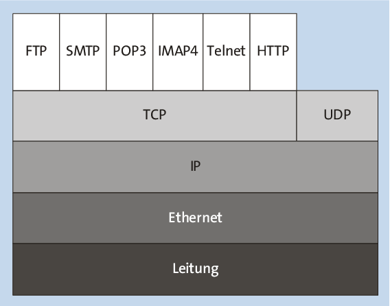
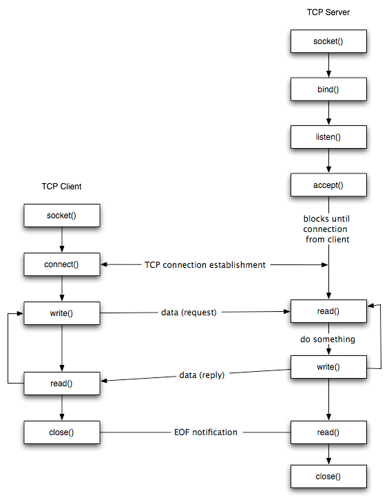
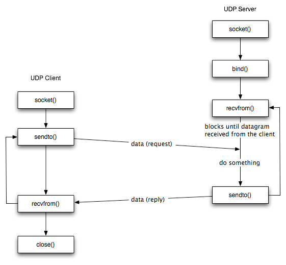

# KNJ-Socket-Programming
## Network Communication
Network communication can be divided into several so-called protocol levelslayer. Figure below shows a greatly simplified version of the OSI layer model,which illustrates the hierarchy of the different protocol levels.
 

The most rudimentary protocol is at the bottom of the graphic. This is the bare cable via which the data is transmitted in the form of electrical impulses. Based on this, there are somewhat more abstract protocols such as Ethernet and IP. However, the part that is actually interesting for application programmers only starts above the IP protocol, namely the transport protocols TCP and UDP. Both logs will be discussed in detail in the context of sockets in the next section.

| Protocol | Description             | Module   |  
|----------|------------------------ |----------|
| UDP      | Basic connectionless network protocol | socket   | 
| TCP      | Basic connection-oriented network protocol | socket   | 
| HTTP     | Transfer text files, such as websites | urllib   | 
| FTP      | File transfer | ftplib   | 
| SMTP     | Sending e-mails | smtplib  | 
| POP3     | Fetching e-mails | poplib   | 
| IMAP4    | Fetching and managing emails | imaplib  | 
| Telnet   | Terminal emulation | telnetlib | 

## Sockets --Low-level networking interface
Sockets and socket API are used to send messges across a network. They provided a form of inter-process communication (IPC). Example is the internet, which we connect to via our ISP.

The most common type of socket applications are client-server applications, where one side acts as the server and waits for connections from clients.

## Socket API Overview

Python's socket [module](https://docs.python.org/3/library/socket.html) provides an interface to the Berkeyly Sockets [API](https://en.wikipedia.org/wiki/Berkeley_sockets). The primary socket API functions and methods in this module are:

- `socket()`: creates a new socket and allocates resources to it
- `bind()`: associates a socket with a socket address structure, i.e. a specified local IP address and a port number. It is used on the server side.
- `listen()`: causes a bound Transmission Control Protocol (TCP) socket to enter a listening state. It is used on the server side.
- `connect()`:assigns a free local port number to a socket. In case of a TCP socket, it causes an attempt to establish a new TCP connection. It is used on the client side.
- `accept()`: accepts a received incoming attempt to create a new TCP connection from the remote client, and creates a new socket associated with the socket address pair of this connection. It is used on the server side.
- `connect_ex()`: like `connect()`, but returns an error indicator instead of raising an exception for errors returned by the C-level connect() call ( other problems, such as "host not found", can still raise exceptions). The error indicator is `0` if the operation succeeded, otherwise the value of the `errno` variable. This is useful to support for example, asynchronous connects.
- `send()` : to send data
- `recv()` : to receive data
- `close()`: causes teh system to release resources allocated to a socket. In case of TCP, the connection is terminated.

As part of its standard library, Python also has [classes](https://docs.python.org/3/library/socketserver.html) that make using these low-level socket functions easier. Read about implementing internet protocols like HTTP and SMTP [here](https://docs.python.org/3/library/internet.html).

## TCP Socket Flow
We are going to use TCP socket here.



TCP provides a connection oriented service, since it is based on connections between clients and servers.

TCP provides reliability. When a TCP client send data to the server, it requires an acknowledgement in return. If an acknowledgement is not received, TCP automatically retransmit the data and waits for a longer period of time.

We have mentioned that UDP datagrams are characterized by a length. TCP is instead a byte-stream protocol, without any boundaries at all.

TCP is described in RFC 793, RFC 1323, RFC 2581 and RFC 3390. 
### TCP Server:

1. **Create a TCP socket**:
   ```python
   # creates a new socket and allocates resources to it
   sock = socket.socket(socket.AF_INET, socket.SOCK_STREAM)
   ```

2. **Bind the socket to the server address**:
   ```python
   #associates a socket with a socket address structure, i.e. a specified local IP address    and a port number. It is used on the server side.
   server_address = ('localhost', 10000)
   sock.bind(server_address)
   ```

3. **Listen for incoming connections**:
   ```python
   # causes a bound Transmission Control Protocol (TCP) socket to enter a listening state. Number of Clients N
   sock.listen(N)
   ```

4. **Accept incoming connection**:
   ```python
   #accepts a received incoming attempt to create a new TCP connection from the remote client, and creates a new socket associated with the socket address pair of this connection.
   connection, client_address = sock.accept()
   ```

5. **Receive data from the client**:
   ```python
   # to receive data
   data = connection.recv(4096)
   ```

6. **Process the received data and send a response to the client**:
   ```python
   # Process the received data here
   reply = b'Received your message!'
   connection.send(reply)
   ```

7. **Close the connection**:
   ```python
   # causes teh system to release resources allocated to a socket. In case of TCP, the connection is terminated.
   connection.close()
   ```

8. **Go back to Step 4**:
   The server typically runs in an infinite loop, continuously accepting incoming connections.

### TCP Client:

1. **Create a TCP socket**:
   ```python
   # creates a new socket and allocates resources to it
   sock = socket.socket(socket.AF_INET, socket.SOCK_STREAM)
   ```

2. **Connect to the server**:
   ```python
   # assigns a free local port number to a socket. In case of a TCP socket, it causes an attempt to establish a new TCP connection
   server_address = ('localhost', 10000)
   sock.connect(server_address) 
   ```

3. **Send a message to the server**:
   ```python
   # to send data
   message = b'This is the message. It will be repeated.'
   sock.send(message)
   ```

4. **Receive a response from the server**:
   ```python
   # to receive data
   data = sock.recv(4096)
   ```

5. **Process the received data and go back to Step 3, if necessary**:
   ```python
   # Process the received data here
   ```

6. **Close the socket and exit**:
   ```python
   sock.close()
   ```

This markdown text provides clear instructions for setting up TCP server and client applications. You can directly copy and paste it into your README.md file in a Git repository.
## UDP Socket Flow
We are going to use UDP socket here.



UDP is a simple transport-layer protocol. The application writes a message to a UDP socket, which is then encapsulated in a UDP datagram, which is further encapsulated in an IP datagram, which is sent to the destination.

There is no guarantee that a UDP will reach the destination, that the order of the datagrams will be preserved across the network or that datagrams arrive only once.

The problem of UDP is its lack of reliability: if a datagram reaches its final destination but the checksum detects an error, or if the datagram is dropped in the network, it is not automatically retransmitted.

Each UDP datagram is characterized by a length. The length of a datagram is passed to the receiving application along with the data.

No connection is established between the client and the server and, for this reason, we say that UDP provides a connection-less service.

It is described in RFC 768. 

Certainly! Here's the updated explanation in markdown format suitable for a Git README file:

### UDP Server:

1. **Create a UDP socket**:
   ```python
   sock = socket.socket(socket.AF_INET, socket.SOCK_DGRAM)
   ```

2. **Bind the socket to the server address**:
   ```python
   server_address = ('localhost', 10000)
   sock.bind(server_address)
   ```

3. **Wait until the datagram packet arrives from the client**:
   ```python
   data, address = sock.recvfrom(4096)
   ```

4. **Process the datagram packet and send a reply to the client**:
   ```python
   # Process the received data here
   reply = b'Received your message!'
   sock.sendto(reply, address)
   ```

5. **Go back to Step 3**:
   The server typically runs in an infinite loop, continuously receiving and responding to data from clients.

### UDP Client:

1. **Create a UDP socket**:
   ```python
   sock = socket.socket(socket.AF_INET, socket.SOCK_DGRAM)
   ```

2. **Send a message to the server**:
   ```python
   server_address = ('localhost', 10000)
   message = b'This is the message. It will be repeated.'
   sock.sendto(message, server_address)
   ```

3. **Wait until a response from the server is received**:
   ```python
   data, server_address = sock.recvfrom(4096)
   ```

4. **Process the reply and go back to Step 2, if necessary**:
   ```python
   # Process the received data here
   ```

5. **Close socket descriptor and exit**:
   ```python
   sock.close()
   ```

This markdown text can be directly copied and pasted into your README.md file in a Git repository, providing clear instructions for setting up UDP server and client applications.